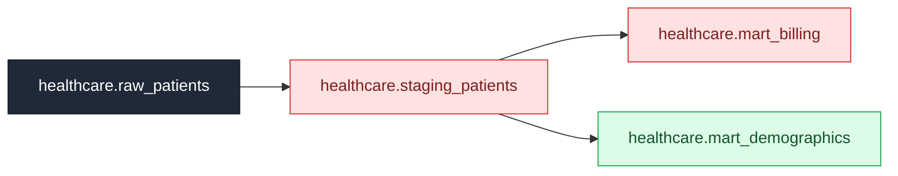

## 💥 Blast Radius report

**Change:** `DROP column urn:li:dataset:(urn:li:dataPlatform:sqlite,healthcare.raw_patients,PROD)::billing_amount`  
**Downstream assets scanned:** 3  
**Impact:** 2 breaking · 0 at-risk · 1 cleared

### ❌ Merge blocked — breaking downstream impact

| | Asset | Kind | Depth | Owners | Why |
|---|---|---|---|---|---|
| 🔴 **BREAKING** | `healthcare.staging_patients` | dataset | 1 | @clinical_team | column-level lineage: billing_amount derive(s) from the changed column |
| 🔴 **BREAKING** | `healthcare.mart_billing` | dataset | 2 | @finance_team | column-level lineage: billing_amount derive(s) from the changed column |
| 🟢 **low** | `healthcare.mart_demographics` | dataset | 2 | @research_team | downstream of an affected asset but does not reference the changed column |

**Owners to notify:** @clinical_team @finance_team

Generated by 💥 Blast Radius using DataHub lineage.

## 🛠️ Migration plan (draft)

To ship `DROP column urn:li:dataset:(urn:li:dataPlatform:sqlite,healthcare.raw_patients,PROD)::billing_amount` safely, address the following before merge.

### @clinical_team
- **`healthcare.staging_patients`** (dataset)
  - [ ] Remove or re-source `billing_amount` — its upstream `billing_amount` is being dropped.

### @finance_team
- **`healthcare.mart_billing`** (dataset)
  - [ ] Remove or re-source `billing_amount` — its upstream `billing_amount` is being dropped.

---
_Draft generated by 💥 Blast Radius. Review before merging — grounded in DataHub column lineage and query history._