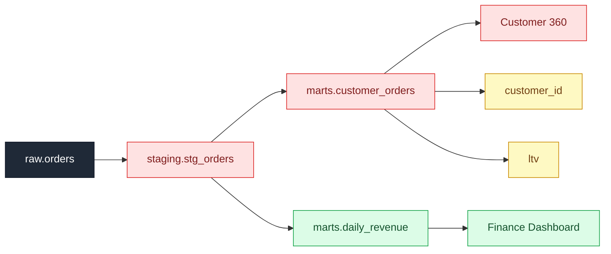

## 💥 Blast Radius report

**Change:** `DROP column urn:li:dataset:(urn:li:dataPlatform:postgres,raw.orders,PROD)::customer_id`  
**Downstream assets scanned:** 7  
**Impact:** 3 breaking · 2 at-risk · 2 cleared

### ❌ Merge blocked — breaking downstream impact

| | Asset | Kind | Depth | Owners | Why |
|---|---|---|---|---|---|
| 🔴 **BREAKING** | `staging.stg_orders` | dataset | 1 | @dana | column-level lineage: customer_id derive(s) from the changed column |
| 🔴 **BREAKING** | `marts.customer_orders` | dataset | 2 | @alice | column-level lineage: customer_id derive(s) from the changed column |
| 🔴 **BREAKING** | `Customer 360` | dashboard | 3 | @alice | column-level lineage: customer_id derive(s) from the changed column |
| 🟡 **AT RISK** | `customer_id` | ml_feature | 3 | @bob | downstream of an affected asset, but no column lineage or query text available to confirm — verify manually |
| 🟡 **AT RISK** | `ltv` | ml_feature | 3 | @bob | downstream of an affected asset, but no column lineage or query text available to confirm — verify manually |
| 🟢 **low** | `marts.daily_revenue` | dataset | 2 | @carol | downstream of an affected asset but does not reference the changed column |
| 🟢 **low** | `Finance Dashboard` | dashboard | 3 | @carol | no dependency on the changed column found in lineage or queries |

**Owners to notify:** @dana @alice @bob

Generated by 💥 Blast Radius using DataHub lineage.

## 🛠️ Migration plan (draft)

To ship `DROP column urn:li:dataset:(urn:li:dataPlatform:postgres,raw.orders,PROD)::customer_id` safely, address the following before merge.

### @dana
- **`staging.stg_orders`** (dataset)
  - [ ] Remove or re-source `customer_id` — its upstream `customer_id` is being dropped.
  - [ ] Definition to update:
    select order_id, customer_id, amount, created_at from raw.orders

### @alice
- **`marts.customer_orders`** (dataset)
  - [ ] Remove or re-source `customer_id` — its upstream `customer_id` is being dropped.
  - [ ] Definition to update:
    select customer_id, count(*) as order_count, sum(amount) as lifetime_amount from staging.stg_orders group by customer_id
- **`Customer 360`** (dashboard)
  - [ ] Remove or re-source `customer_id` — its upstream `customer_id` is being dropped.

### @bob
- **`customer_id`** (ml_feature)
  - [ ] Remove or re-source `customer_id` — its upstream `customer_id` is being dropped.
- **`ltv`** (ml_feature)
  - [ ] Remove or re-source `customer_id` — its upstream `customer_id` is being dropped.

---
_Draft generated by 💥 Blast Radius. Review before merging — grounded in DataHub column lineage and query history._